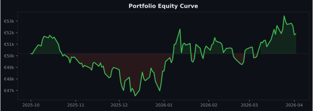
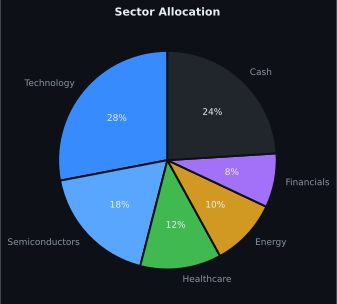
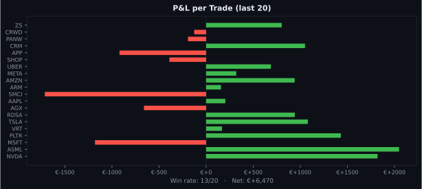
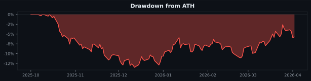

# Trader — Agent-First Trading CLI

A headless trading CLI for stocks, ETFs, and options via Interactive Brokers. Designed for AI agent consumption — all output is JSON, all commands are self-documenting via `--help`.

An autonomous portfolio conductor runs on a cron schedule, dispatching specialist agents that assess market conditions, manage risk, and execute trades — all without manual intervention.

---

## Requirements

- Python 3.10+
- [uv](https://docs.astral.sh/uv/getting-started/installation/)
- IBKR account (paper or live) — [open one here](https://www.interactivebrokers.com)
- Java 17+ (for the IBKR Client Portal Gateway)
- [Benzinga API key](https://benzinga.com/apis) (for news/sentiment commands)

---

## Quick Start

### 1. Install

```bash
git clone <this-repo> && cd trader
uv sync
```

### 2. Configure

```bash
cp .env.example .env
```

Fill in the required values in `.env`:

| Variable | Description |
|----------|-------------|
| `IB_ACCOUNT` | Your IBKR account ID — paper starts with `DU`, live with `U` |
| `IBEAM_ACCOUNT` | Same as `IB_ACCOUNT` |
| `IBEAM_PASSWORD` | Your IBKR login password |
| `BENZINGA_API_KEY` | From [benzinga.com/apis](https://benzinga.com/apis) |
| `AGENT_MODE` | `supervised` (safe default) or `autonomous` |

Everything else can stay as defaults to get started.

> **Start with `AGENT_MODE=supervised`** — the agent logs what it *would* do without placing real orders. Switch to `autonomous` once you're comfortable.

### 3. Set up the IBKR Client Portal Gateway

Download and unzip the gateway (one-time):

```bash
wget https://download2.interactivebrokers.com/portal/clientportal.gw.zip
unzip clientportal.gw.zip -d clientportal.gw
```

Start it:

```bash
cd clientportal.gw && ./bin/run.sh root/conf.yaml
```

> **macOS:** If port 5001 is blocked, go to System Settings → General → AirDrop & Handoff → AirPlay Receiver → **Off**, then restart the gateway.

### 4. Authenticate

Open **https://localhost:5001** in your browser and log in with your IBKR credentials (+ 2FA if enabled). Select **Paper Trading** or **Live Trading** at the login screen.

For headless / remote servers, SSH tunnel first:

```bash
ssh -L 5001:localhost:5001 user@your-server
# then open https://localhost:5001 locally
```

### 5. Keep the session alive (ibeam)

The gateway session expires after ~10 min of inactivity. `ibeam` keeps it alive automatically:

```bash
./scripts/start-gateway.sh
```

You authenticate once in the browser — ibeam sends a `/tickle` ping every ~60s from then on. If the session ever drops, just re-authenticate in the browser once more.

**Fully automatic re-auth** (no browser needed after first setup) requires a TOTP secret:
- Re-enroll 2FA in IBKR Account Management using a standard authenticator app (Google Authenticator, Authy)
- Copy the base32 secret shown during enrollment
- Set `IBEAM_AUTHENTICATE=True` and `IBEAM_KEY=<secret>` in `.env`

> **Note:** `buying_power` from `trader account balance` reflects IBKR's margin capacity (~6.7× cash on some accounts). This system always uses `cash` only — never margin.

### 6. Verify connection

```bash
uv run trader account balance
```

Expected output:
```json
{
  "cash": 250000.0,
  "net_liquidation": 250000.0,
  "buying_power": 1666666.6,
  "currency": "USD"
}
```

---

## Command Reference

```bash
# Account
uv run trader account summary
uv run trader account balance
uv run trader account margin

# Quotes
uv run trader quote get AAPL MSFT TSLA
uv run trader quote chain AAPL --expiry 2026-04-17

# Orders
uv run trader orders buy AAPL 10 --type limit --price 195.00
uv run trader orders sell AAPL 10 --type market
uv run trader orders bracket AAPL 10 --entry 195 --take-profit 205 --stop-loss 190
uv run trader orders stop AAPL --price 190.00
uv run trader orders trailing-stop AAPL --trail-percent 2.5
uv run trader orders take-profit AAPL --price 210.00
uv run trader orders list --status open
uv run trader orders cancel <order-id>
uv run trader orders modify <order-id> --price 196.00

# Positions
uv run trader positions list
uv run trader positions close AAPL
uv run trader positions pnl

# News
uv run trader news latest --tickers AAPL MSFT --limit 10
uv run trader news sentiment AAPL --lookback 24h

# Strategies
uv run trader strategies run AAPL --strategy rsi
uv run trader strategies signals --tickers AAPL MSFT TSLA --strategy macd
uv run trader strategies backtest AAPL --strategy rsi --from 2025-01-01
uv run trader strategies optimize AAPL --strategy rsi
```

All commands support `--help` for full options.

---

## Autonomous Agent

The portfolio conductor runs on a cron schedule and dispatches specialist agents. All times are CET.

| Schedule | Slot | What runs |
|----------|------|-----------|
| Weekdays 8:03am | eu-pre-market | calendar gate → geo scan → news analyst → risk-monitor → portfolio-health → opportunity-finder (EU) → order-alert-manager |
| Weekdays 9am–3pm hourly | eu-market | risk-monitor → portfolio-health → opportunity-finder (EU + US pre-market) if stale |
| Weekdays 3:03pm | eu-us-overlap | full dispatch — both EU and US universes, highest liquidity window |
| Weekdays 5–9pm hourly | us-market | calendar gate → geo scan → news analyst → risk-monitor → portfolio-health → opportunity-finder (US) if stale |
| Sundays 6pm | weekly | market-top-detector → sector-analyst → market-news-analyst → portfolio-health → strategy-optimizer → performance review |
| 1st Sunday of month | monthly | strategy-optimizer → system-improver (decision quality audit + self-improvement) |

Logs: `.trader/logs/agent.jsonl` — every decision, intent, and order.
Snapshots: `.trader/logs/portfolio_evolution.jsonl` — timestamped NLV/position state on every run.

**Guardrails (enforced on every proposed trade):**
- Never uses margin — all sizing uses `cash`, never `buying_power`
- Cash floor: no new buys if cash < 10% of net liquidation (`CASH_FLOOR_BLOCK`)
- Single position cap: configurable in `profile.json` (default 5% NLV)
- Max 3 new positions per day
- `risk_mode=ELEVATED` (2+ high-impact calendar events): position sizes halved, no new entries

Edit `.trader/profile.json` to adjust risk tolerance, preferred sectors, and position limits.

---

## Workflow Diagram


---

## Portfolio Stats

> Demo data — run `uv run trader report --save-assets` to regenerate with your real account data, then commit the updated `docs/assets/` files.

<p align="center">
  
  
</p>
<p align="center">
  
  
</p>

```bash
uv run trader report               # generates outputs/report.html
uv run trader report --save-assets # refreshes docs/assets/ for the README
uv run trader report --open        # opens report in browser
```

---

## Paper vs Live Trading

Controlled entirely at the gateway login — select **Paper Trading** or **Live Trading** when you authenticate at `https://localhost:5001`. No code or config change needed to switch.

---

## Development

### Running the server

```bash
make server          # start FastAPI + scheduler + Telegram polling
make kill            # stop it
```

Or directly: `uv run trader-server`

### Testing

```bash
make test
```

> **Always use `make test` or `uv run python -m pytest`** — never bare `pytest`.
> The system Homebrew `pytest` runs on Python 3.12 and can't see the packages in the uv venv (Python 3.10), causing all server tests to fail with `ModuleNotFoundError`.

### Docker

```bash
make docker-up       # build image and start in background
make docker-logs     # tail logs
make docker-down     # stop and remove containers
```

Requires a `.env` file at the project root (copy from `.env.example`).

---

## Common Issues

**`ConnectTimeout`** — Gateway is not running. Start it (`clientportal.gw/bin/run.sh`) and authenticate in the browser.

**`not authenticated`** — Session expired. Open `https://localhost:5001` and log in again. Run `./scripts/start-gateway.sh` to keep it alive going forward.

**`Address already in use` (port 5001)** — On macOS, disable AirPlay Receiver in System Settings → General → AirDrop & Handoff.

**`No open position for AAPL`** — You don't hold a position; buy first before closing or setting stops.

**Agent places no orders** — Check `AGENT_MODE` in `.env`. If `supervised`, it logs intent only. Check `.trader/logs/agent.jsonl` for `CASH_FLOOR_BLOCK` or guardrail rejections.
